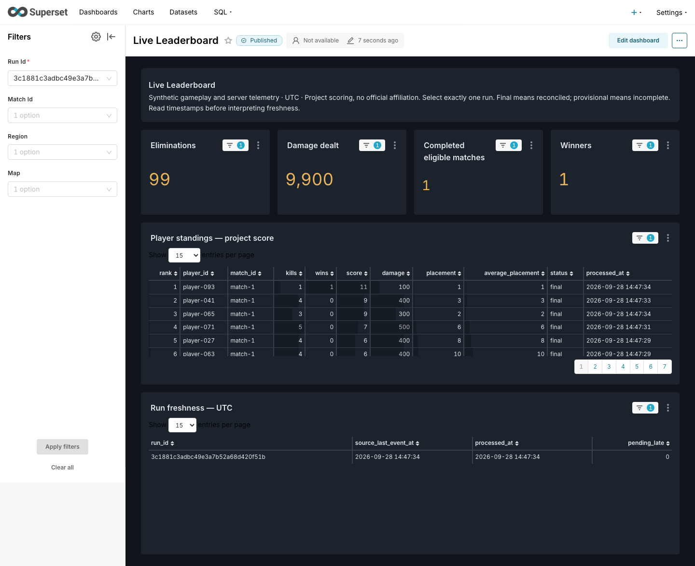
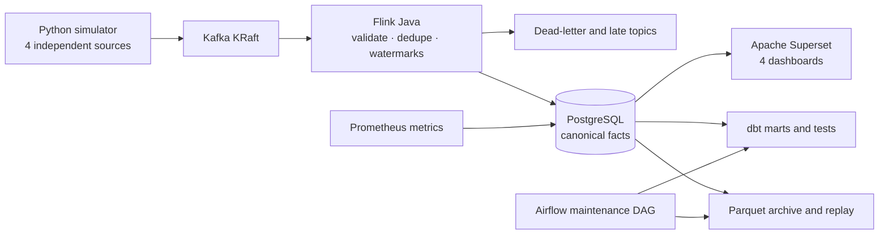
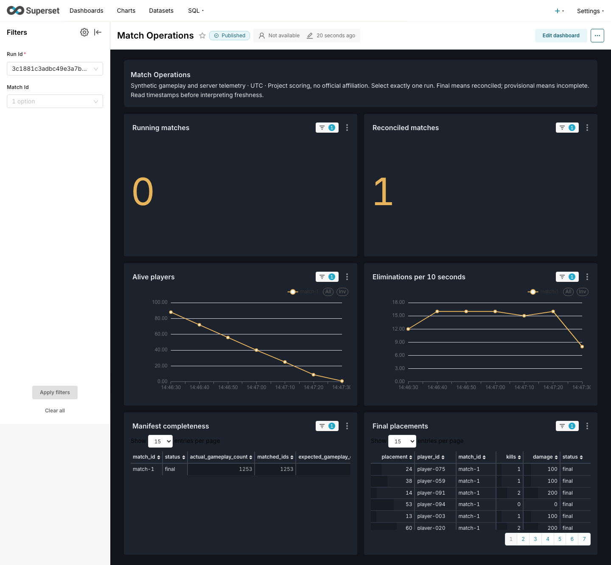
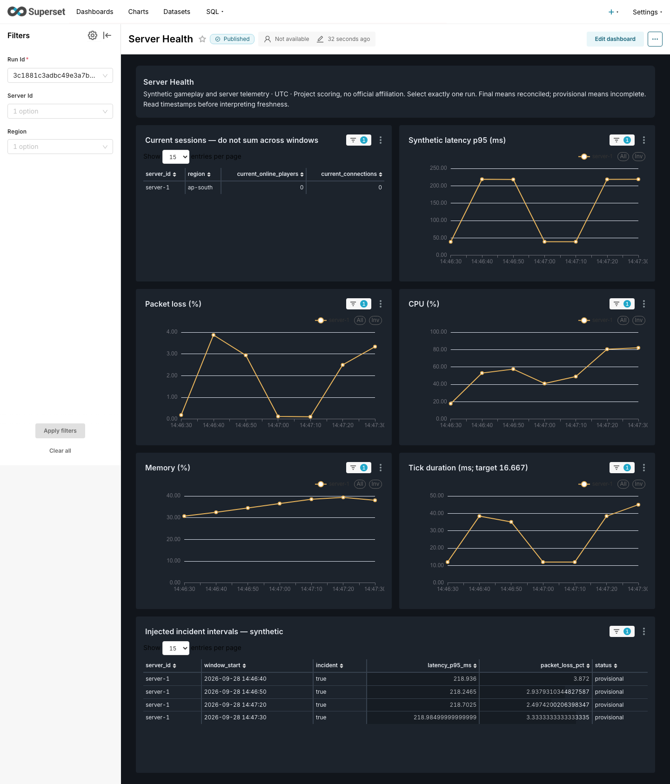
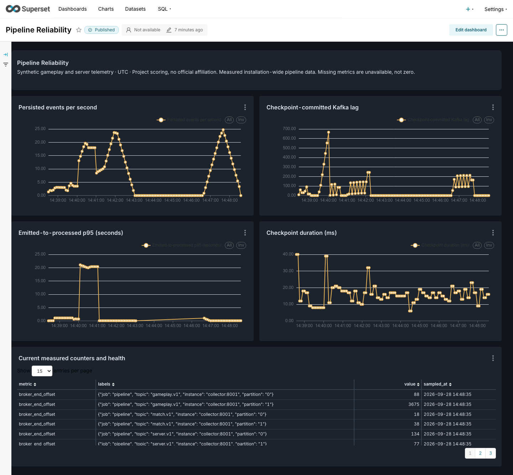

# Battleground Telemetry

**Real-time analytics for a synthetic battle-royale game: four event sources stream through Kafka and Flink into PostgreSQL and four live Apache Superset dashboards.**

`Python` · `Kafka (KRaft)` · `Flink (Java)` · `PostgreSQL` · `Apache Superset` · `dbt` · `Airflow` · `Prometheus` · `Docker Compose`

[**Project showcase page**](https://gv1shnu.github.io/pubg/) · [Architecture](docs/architecture.md) · [Acceptance evidence](docs/acceptance.md) · [Demo script](docs/demo.md)



All gameplay and server data is synthetic. There is no official PUBG affiliation or official scoring formula.

## Highlights

- **Correct under messy delivery.** Out-of-order, duplicated, late and malformed events are handled explicitly. Flink validates contracts, deduplicates keyed identities with a 24-hour TTL, tracks event-time watermarks and routes rejects to a dead-letter topic. Results stay *provisional* until the immutable facts match the source manifest, then become *final*.
- **Recovers from failure.** With the Flink TaskManager killed mid-run, checkpoint-committed Kafka lag rose from 108 to 553, then drained to zero after recovery with results unchanged.
- **Measured, not claimed.** In a clean 100-player benchmark, 1,524 records were persisted with a **106 ms p95** emitted-to-processed delay. A browser test showed a new database value on an auto-refreshing dashboard **12.9 s** after it was observed.
- **Tested end to end.** 69 Python unit tests, 4 Java JUnit tests, 4 real-stack integration tests, 12 dbt models with 22 dbt tests, and a six-task Airflow maintenance DAG all passed.
- **Reproducible dashboards.** All four dashboards (24 charts) are authored in code ([`superset/bootstrap.py`](superset/bootstrap.py)), with no manual chart assembly.

## Architecture



## Dashboards

| Live Leaderboard | Match Operations |
|---|---|
|  |  |
| Player ranks, kills, damage and placement for one run. Each row shows whether it is provisional or final. | Running vs reconciled matches, alive players, eliminations over time and manifest completeness. |
| **Server Health** | **Pipeline Reliability** |
|  |  |
| Synthetic latency p95, packet loss, CPU, memory and tick duration, with injected incident windows labelled. | Measured throughput, checkpoint-committed Kafka lag, processing delay and checkpoint duration. |

## Project status

**0.1.0-dev.2 is a development prerelease on `dev`.** See [STATUS](STATUS.md) and [acceptance evidence](docs/acceptance.md) for verified results and limits. Superset is the selected dashboard surface. Tableau specifications are retained only as an optional reference.

## Run the demo

Requires Docker Compose and Python 3, on an authorized Linux workspace or local Docker host. No paid services or trials are provisioned. Local testing was explicitly authorized; cloud operation remains subject to available quota.

```sh
make bootstrap       # Build, migrations, topics, Flink submission, actual four-source smoke match
make demo            # Default 100-player run, approximately four minutes
make bi-up           # Author four real Superset dashboards automatically
make status
make scenario SCENARIO=latency-spike
make smoke           # After completion
make reconcile
make dbt
make down            # Preserve data
```

Open [Superset](http://localhost:8088). Username `admin`; password is the `SUPERSET_ADMIN_PASSWORD` value in the ignored local `.env`. Select one run in the dashboard filter; pipeline metrics have installation scope. PostgreSQL and Kafka are not exposed to the host. Admin HTTP ports bind only to loopback; keep cloud forwards private.

For an Apple Silicon host without Docker, the local test setup uses an isolated Colima profile: `colima start --profile battleground --cpu 6 --memory 12 --disk 50 --vm-type vz --mount-type virtiofs`. Docker, Compose and Colima must already be installed. Bootstrap measures the Docker VM's capacity and generates local credentials without printing them.

## Project map

- `simulator/`, `contracts/`: four independent source schedules, shared match invariants, Pydantic/versioned JSON contracts.
- `streaming/`: Flink validation, Kafka watermarks/idleness, side outputs, keyed TTL deduplication, windows, persistent checkpoints and idempotent JDBC sinks.
- `warehouse/`: canonical facts, manifest reconciliation, revisioned sessions, server windows, live mart views and separate database roles.
- `superset/`: pinned application image, secure local initialization and reproducible authoring of four dashboards; no manual chart assembly.
- `dbt/`, `orchestration/`: documented transformations/tests, historical correction and manual archive/reconcile/dbt/export DAG.
- `observability/`: actual producer/broker/consumer/database/checkpoint observations and Prometheus.
- `scripts/`, `tests/`: operations, archive/replay, faults, bounded benchmark and browser evidence.

## Validate

```sh
make test
make integration
make dbt
python -m scripts.fault_acceptance
python -m scripts.benchmark
make ops-up
# Trigger telemetry_maintenance in private Airflow UI/CLI
make ops-down
```

Browser verification: install `requirements-browser.txt`, run `python -m playwright install chromium`, then `python -m scripts.verify_superset`. Images and measured browser responses are saved under ignored `artifacts/superset/`.

[Guarantees](docs/guarantees.md) · [Metric definitions](docs/metrics.md) · [Operations](docs/operations.md) · [Superset setup](superset/README.md) · [BI decision](docs/bi-decision.md) · [90-second / three-minute demo](docs/demo.md) · [Five-minute interview walkthrough](docs/interview.md)

This is a single-broker portfolio deployment, not a production or high-availability service. Checkpoints do not imply end-to-end exactly-once delivery. Do not interpret a quiet completed run as a failed pipeline or a periodically queried dashboard as push streaming.
