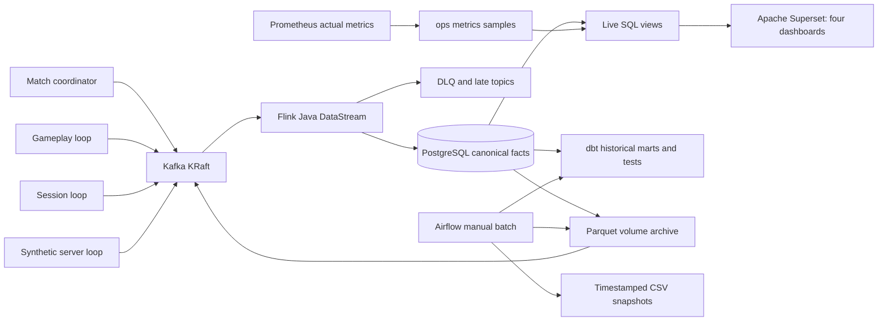

# Architecture

The four source loops are independently scheduled tasks in one process, with separate Kafka clients. Shared authoritative match state keeps gameplay consistent without extra infrastructure. Match outcomes are seeded; server measurements and gameplay are clearly synthetic. The operational exporter reads real broker end/committed offsets, PostgreSQL persistence and Flink checkpoint status, and Prometheus scrapes real component metrics.

Flink validates typed/schema contracts, deduplicates keyed identities for 24 hours, tracks event-time watermarks, routes rejected/late records, computes diagnostic server window observations and sends idempotent JDBC writes. PostgreSQL computes live canonical facts and project rankings at the declared grains. This deliberately trades small-demo SQL query work for correctness under reordered/repeated delivery. Correlated manifest checks may be expensive at larger volumes: filter one namespace/run, use indexes, inspect the supplied EXPLAIN benchmark before expanding scale.

Airflow orchestrates a bounded archive/reconciliation/dbt/export batch; it does not process individual events. dbt builds documented views and a historical player-match mart with explicit keys and complete re-reading of eligible demo matches for late corrections. The archive is a Parquet file and manifest on a Docker named volume, not S3 or a distributed lake.

The `core` service limits total approximately 5.25 GiB, plus Docker, the workspace and occasional toolbox processes. This is a planning budget, not measured usage. Bootstrap records Docker VM capacity and refuses under 6 GiB, which is a guardrail rather than a fit guarantee. Build images before the full runtime. Stop core workers before the heavier ops image build if constrained. Use `python -m scripts.benchmark` for measured samples.

## Tested compatibility matrix

| Component | Pin | Observed verification |
|---|---|---|
| Java / Flink | Java 17 / 1.20.1 | Maven build, four JUnit tests and running stream |
| Kafka / JDBC connectors | 3.3.0-1.20 | Actual Kafka consumption and PostgreSQL writes |
| PostgreSQL JDBC | 42.7.5 | Integration and checkpoint recovery |
| Kafka broker | 3.9.0 KRaft | Four sources, lag growth and drain |
| PostgreSQL | 16.8-bookworm | Canonical SQL, reconciliation, dbt and dashboard queries |
| Python container | 3.11.11 | 69 unit and four real integration tests |
| dbt Core / postgres | 1.9.3 / 1.9.0 | 12 models and 22 tests passed |
| Airflow | 2.10.5-python3.11 | All six manual DAG tasks succeeded |
| Prometheus | 3.2.1 | Actual scrapes and persisted operational samples |
| Superset | 5.0.0 | 24 charts across four authenticated dashboards |

Airflow runs dbt in a separate `/opt/dbt` virtual environment to avoid incompatible protobuf dependencies. Source/configuration is baked into images; shared artifacts and checkpoints use named volumes. This also avoids macOS Desktop bind-mount permissions. `make export-artifacts` copies outputs back to the checkout.

Direct dependencies/images are version-pinned, not fully digest-locked. Verification covers the local Apple Silicon Docker deployment described in acceptance evidence; it is not a production compatibility guarantee.
